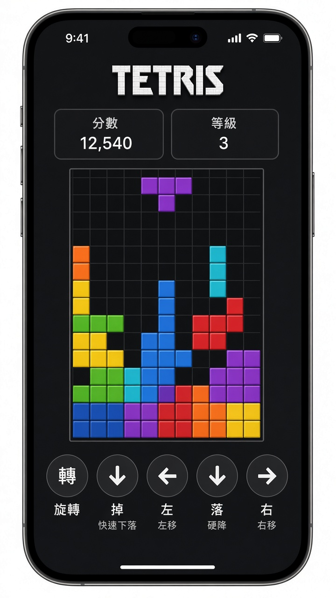
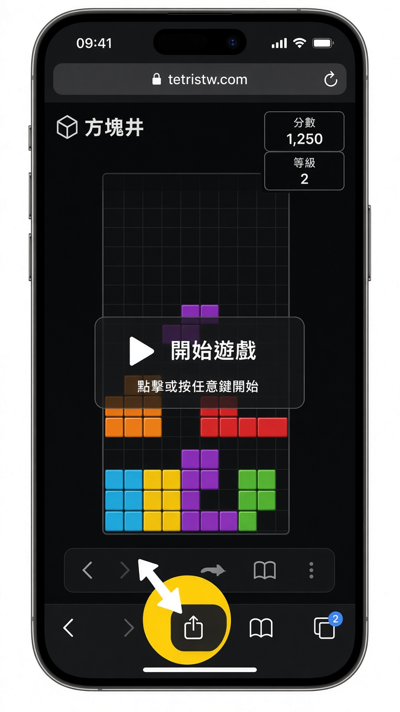
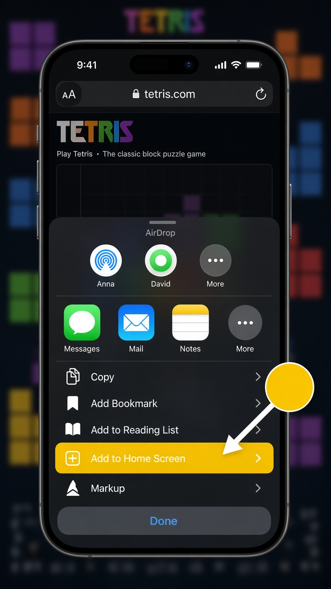
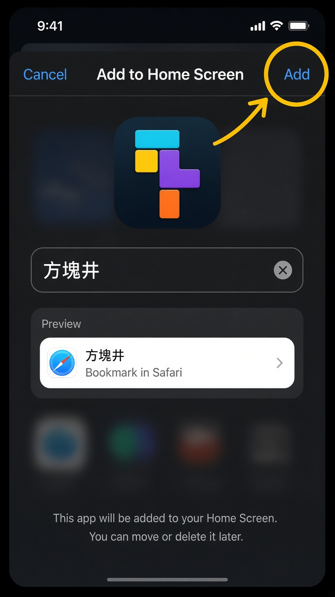
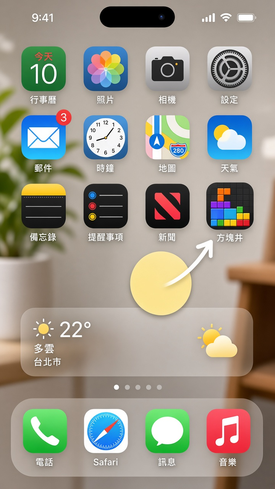

# 方塊井 (Fangkuai Jing)

A small **test project**: a Tetris-style web game built to run on iPhone like an app.

You do **not** need the App Store or Xcode. This is a [Progressive Web App](https://web.dev/progressive-web-apps/) (PWA). Open it in **Safari**, add it to the Home Screen, and it launches full-screen with its own icon.

<p align="center">
  
</p>

<p align="center"><em>After you add it to the Home Screen, it opens like a normal app — no Safari address bar.</em></p>

## What this project is

| | |
| --- | --- |
| **Name** | 方塊井 |
| **Type** | Static HTML / CSS / JS game |
| **Target** | iPhone Home Screen (Safari PWA) |
| **Play** | Touch pad on the phone, or keyboard on a computer |

The page already includes everything iOS needs to treat it as an app:

- `manifest.webmanifest` — name, icon, standalone display
- Apple meta tags — full-screen, status bar, Home Screen title
- `sw.js` — caches files so the game can load again after the first visit
- App icons in `icons/`

## Quick start (computer)

Serve the folder over HTTP. Opening `index.html` as a file (`file://`) will not register the service worker.

```bash
# from the repo root
python3 -m http.server 8080
```

Then open [http://localhost:8080](http://localhost:8080) in a browser.

## Put it on the internet (needed for iPhone)

Safari only treats this as a real app when the site is served over **HTTPS**. The easiest free option is **GitHub Pages**.

1. Push this repo to GitHub (already true for [samchoyvtc/tetris-pwa](https://github.com/samchoyvtc/tetris-pwa)).
2. On GitHub: **Settings → Pages**.
3. Under **Build and deployment**, set **Source** to **Deploy from a branch**.
4. Choose branch **`main`** and folder **`/` (root)**, then **Save**.
5. Wait a minute, then open:

```text
https://samchoyvtc.github.io/tetris-pwa/
```

Any other HTTPS host (Vercel, Netlify, your own server) works the same way — upload the repo as static files.

> **Local iPhone test:** computer and iPhone on the same Wi‑Fi, then visit `http://YOUR-COMPUTER-LAN-IP:8080` in Safari. Add to Home Screen still works, but offline / service worker is more reliable on HTTPS.

---

## Tutorial: turn this website into an iPhone app

Use **Safari**. Chrome, Firefox, and in-app browsers on iPhone cannot add a proper Home Screen app.

The pictures below are visual guides of the iOS Safari flow. Your game screen will match this repo; the Share sheet and Home Screen look like iOS.

### Step 1 — Open the site in Safari

On the iPhone, open **Safari** and go to your HTTPS URL (for example `https://samchoyvtc.github.io/tetris-pwa/`).

<p align="center">
  
</p>

Tap the **Share** button in the Safari toolbar — the square with an **arrow pointing up**.

On most iPhones it sits at the **bottom center**. On iPad it is often at the top.

### Step 2 — Choose Add to Home Screen

A share sheet slides up. Scroll the list if you do not see the action yet.

<p align="center">
  
</p>

Tap **Add to Home Screen**.

If that row is missing:

1. Scroll to the bottom of the sheet and tap **Edit Actions**.
2. Enable **Add to Home Screen**.
3. Open Share again.

### Step 3 — Confirm the name, then tap Add

iOS shows a preview with the app icon and name.

<p align="center">
  
</p>

1. Leave the name as **方塊井**, or type a shorter name.
2. Tap **Add** in the **top right**.

### Step 4 — Launch it from the Home Screen

iOS places a new icon on your Home Screen.

<p align="center">
  
</p>

Tap **方塊井**. It should open **full screen**, without the Safari address bar or toolbar.

That is the “app”. It is still this website, but iOS displays it in **standalone** mode.

### Step 5 — Check that it behaves like an app

| Check | What you should see |
| --- | --- |
| No browser chrome | No URL bar, no Safari toolbar |
| Own icon | 方塊井 on the Home Screen |
| Own title | 方塊井 in the app switcher |
| Play | On-screen pad: 轉 / 掉 / 左 / 落 / 右 |
| Again later | Opens even with a flaky network after the first load |

If you still see Safari’s address bar, you opened the **bookmark in Safari** instead of the **Home Screen icon**. Close Safari and tap the icon on the Home Screen.

---

## Controls

**On iPhone (touch pad)**

| Button | Action |
| --- | --- |
| 轉 | Rotate |
| 掉 | Hard drop |
| 左 / 右 | Move |
| 落 | Soft drop |

**On a computer (keyboard)**

Arrow keys move and soft-drop, Up rotates, Space hard-drops. The game also accepts swipe / tap on the well.

## Project layout

```text
.
├── index.html              # Page, iPhone meta tags, HUD + pad
├── styles.css              # Full-screen iPhone layout
├── manifest.webmanifest    # PWA name, icons, standalone mode
├── sw.js                   # Offline cache
├── icons/                  # Home Screen / Apple touch icons
├── js/                     # Game, input, render, sound
├── scripts/generate-icons.py
└── docs/iphone-guide/      # Pictures used in this README
```

## Why this works on iPhone

Apple does not let a random website appear in the App Store by itself. This project uses the **Add to Home Screen** path that Safari has supported for years:

1. `apple-mobile-web-app-capable` and `mobile-web-app-capable` ask iOS for full-screen.
2. `apple-touch-icon` is the Home Screen icon.
3. The web app manifest sets `"display": "standalone"` so the second launch looks like a native app.
4. The service worker caches the game files after the first visit.

This is enough for a test / demo app. It is **not** a signed App Store binary (no Game Center, no push via APNs, no TestFlight). For a store listing you would wrap the same site in something like [Capacitor](https://capacitorjs.com/) and submit through Apple Developer.

## Troubleshooting

| Problem | What to try |
| --- | --- |
| No **Add to Home Screen** | Use **Safari**, not Chrome. Edit Actions in the share sheet. |
| Icon opens in Safari instead of full screen | Delete the icon, add it again from the HTTPS URL, launch from Home Screen. |
| Old version of the game | On iPhone: delete the icon, wait, add again. Service worker cache name is in `sw.js`. |
| Blank page | Confirm GitHub Pages (or your host) is serving `index.html` at the URL you opened. |
| Sound silent | iOS starts audio only after a tap. Press **開始** once. |

## License

Test / demo project. Tetris is a trademark of Tetris Holding; this is an unofficial clone for learning how a web page becomes an iPhone Home Screen app.
